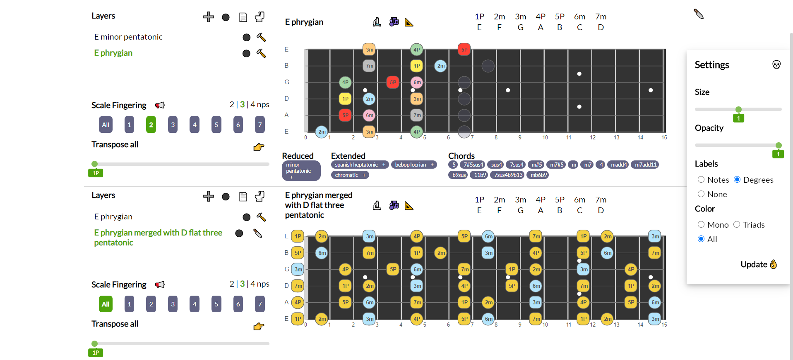
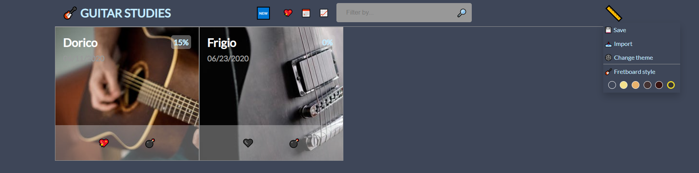

# GUITAR FRETBOARDS 2

GUITAR FRETBOARDS 2,  the revamped remake of [notes-on-fretboard](https://github.com/LorenzoCorbella74/notes-on-fretboard) and [vue-fretboard](https://github.com/LorenzoCorbella74/vue-fretboard), aims to be the definitive free web app for the organisation of guitar studies on the superimpositions of scales and arpeggios.

GUITAR FRETBOARDS 2 is optimised to be responsive up to ***800px*** so it can be used on tablets or larger screen.

For a demo please go [here](https://laughing-mccarthy-3ab279.netlify.app/). 

Guitar images courtesy of [Pexels](https://www.pexels.com).  

## Features
- [x] can display fingerings according to tuning, root, scales 
- [x] scale fingerings are shown on the entire fretboard or for single modes of the scale with 2, 3 and 4 notes per string.
- [x] labels with notes'names or degrees and settings panel to customize notes' size and opacity.
- [x] can merge scales with a graphical comparison of the notes in common and distint on each scale. 
- [x] fast switch between scale and relative arpeggio
- [x] responsive svg fretboards
- [x] persistence with localstorage with save and import functionalities
- [x] can play guitar scales via [soundfont-player](https://github.com/danigb/soundfont-player)
- [ ] Modal interchange table
- [ ] Circle of Fifths
- [ ] Chord progressions  

## Built With
- HTML5, SASS
- no icons just HTML5 EMOJI !!
- no FE Frameworks, just Vanilla ES6 Javascript !!
- no BE just localstorage !!
- [tonal](https://github.com/danigb/tonal)
- Webpack 4

## License
This project is licensed under the MIT License.
