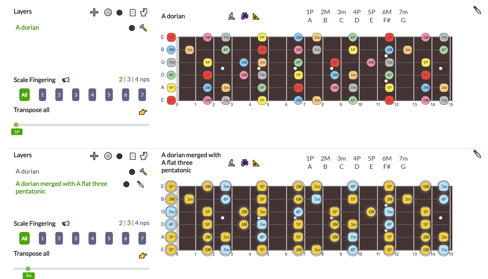
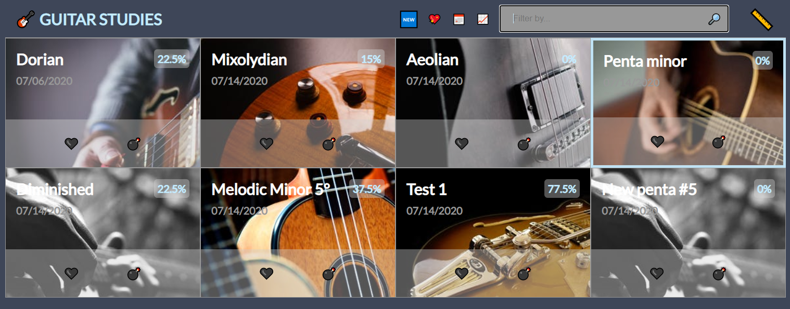
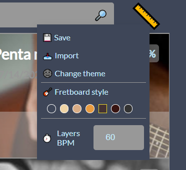
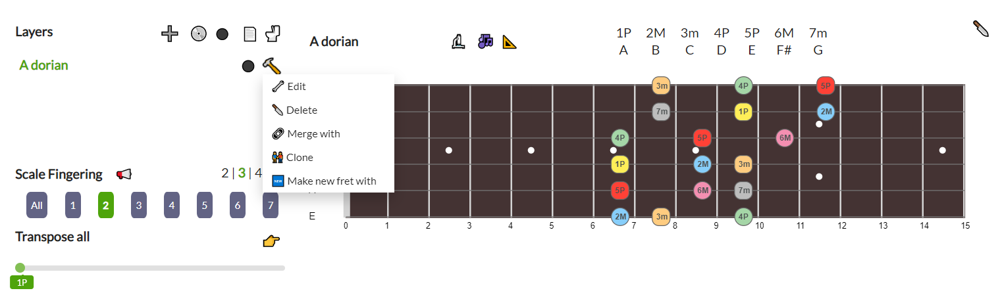
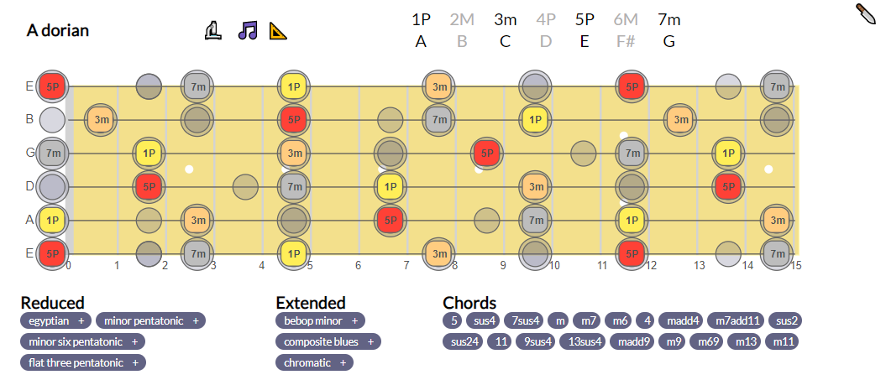
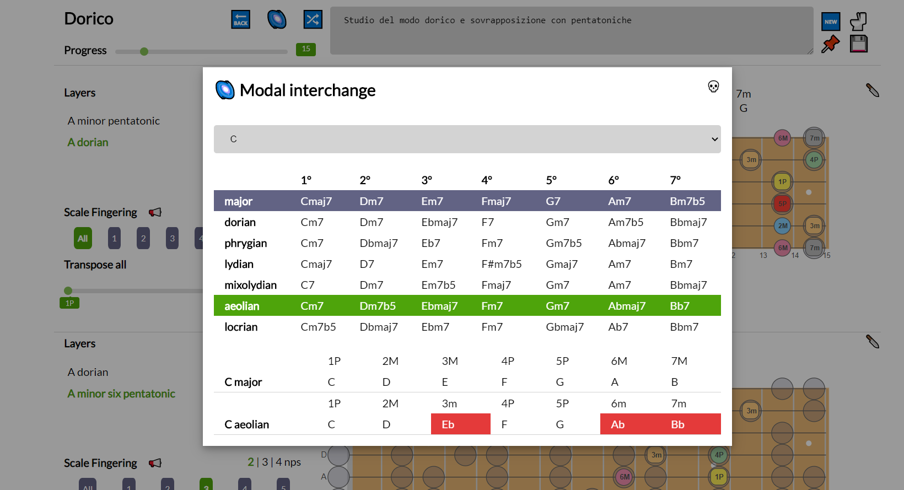
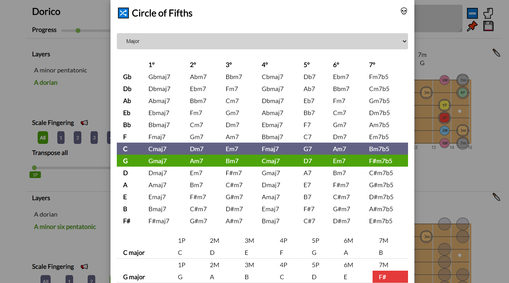
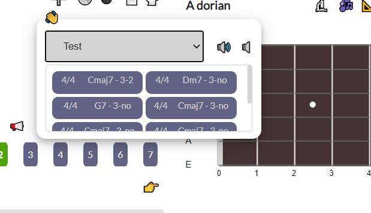
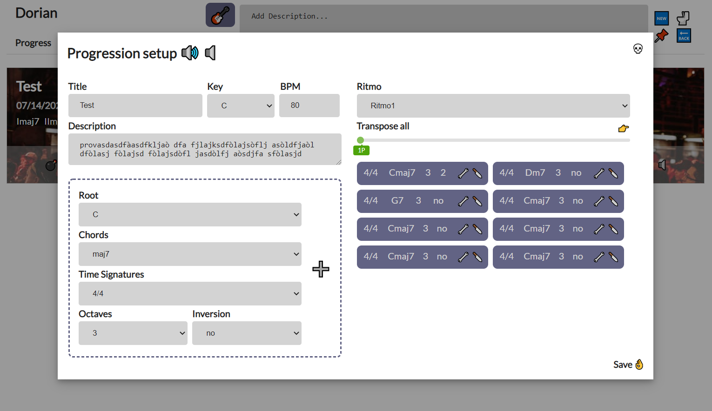
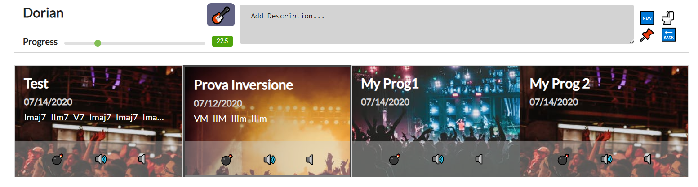

# GUITAR FRETBOARDS 2

GUITAR FRETBOARDS 2,  the revamped remake of  [vue-fretboard](https://github.com/LorenzoCorbella74/vue-fretboard), aims to be the definitive free web app for the organisation of guitar studies on the superimpositions of scales and arpeggios.

It is optimised to be responsive up to ***800px*** so it can be used on tablets or larger screen.

For a demo go [here](https://guitar-fretboards-2020.netlify.app/). 

Guitar images courtesy of [Pexels](https://www.pexels.com).  

# Documentation
GUITAR FRETBOARDS 2 is based on two pages: the `list page` and the `single study page`. 

##  LIST page
In the list page it is possible to select a single study or filter guitar studies by tags, favourites, progress status, creation date or free text. 

On the right side of the header a  dropdown menu permits to customise the app settings and save / import the personal app data:

## Single STUDY page

On the study page it' possible to create both fretboards visualisations and chords proressions: on the header of the single study page the provided button permits to switch between the "progression mode" &#127929;  and the "fretboard mode" &#127928;..

## Fretboards mode
Click the 🆕 button on the header to add responsive svg fretboard visualisations! for each fretboard it's possible to:
- ➕ add layer
- 🚽 delete all layers, 
- 📀 play a loop of the selected layers  
- 📄 add a text note to the fretboard
- ⚫ Show a table with a comparison between the selected layer notes and the ones of the other layers

Each single layer has multiple available actions in the provided menu:
- layer visibility on/off, 
- delete layer
- clone layer, 
- send layer to a new fretboard
- merge with a new scale (for a graphical comparison of the notes in common and distint on each scale)

On the left side of the fretboad panel it's possibile to 
- select one layer
- choose the relevant scale fingerings (of the entire fretboard or for single modes of the selected scale with 2, 3 and 4 notes per string patterns)
- 📢 play the selected layer.
- 👉 transpose all layers of the relevant fretboard with a single click!

In the right side of the fretboard info panel it's summarised the relevant information of only the selected layer and several buttons to activate further functions:
- 🎶 toggle between the scale and its relative arpeggio
-  📐 open the settings panel (labels with notes'names or degrees and notes' size and opacity for better graphic overlapping)
-  🔬 toggle a footer where the relevant chords of the choosen scale and the relative extended and reduced scales are shown
-  🔪 erase the entire fretboard

### Widgets
In the single study page several widgets are available:
- 🌌 Modal interchange table

- 💫 Circle of Fifths

- 📣 Player (to play chord progressions and check the fretboards visualisation on the same page...)

## Chord progression mode
Click the 🆕 button on the header to add chord progressions and fill the relevant study with amazing progressions! 

Once saved it's possible to edit / erase and play / stop the relevant progression.

## Built With
- HTML5, SASS
- Webpack 4
- no icons just HTML5 EMOJI!!
- no FE Frameworks, just Vanilla ES6 Javascript!!
- BE with Firebase!!
- [tonal](https://github.com/danigb/tonal)
- [soundfont-player](https://github.com/danigb/soundfont-player)

## License
This project is licensed under the MIT License.
